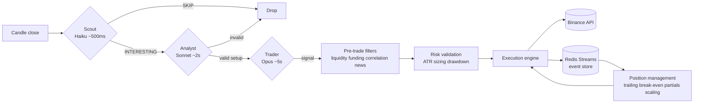

# KavziTrader

LLM-Based Crypto Trading Platform for Binance

## About

KavziTrader is a **personal research project** exploring the trading
capabilities of Large Language Models. It is not a product, not a service, and
not financial advice.

## Disclaimer

Trading cryptocurrencies carries significant risk, including possible total
loss of capital. This software is experimental and provided "as is" with no
warranty — use at your own risk. See [DISCLAIMER.md](DISCLAIMER.md) for the
full statement.

## Overview

KavziTrader is an algorithmic trading platform designed for cryptocurrency trading on Binance. The platform implements a **Brain-Spine Architecture** that leverages Large Language Models (LLMs) for intelligent market analysis while maintaining deterministic, real-time execution.

**Key Architectural Concepts:**

- **The Brain**: Tiered PydanticAI agents (Haiku → Sonnet → Opus) for cost-optimized reasoning
- **The Spine**: High-speed async execution with dynamic risk and position management
- **Order Flow Edge**: Funding rates, OI, and liquidation levels for informed decisions
- **Validation Firewall**: Multi-layer safety with confidence calibration

## Features

- **Tiered LLM Agents**: Cost-optimized analysis (90%+ filter rate with cheap Scout)
- **Order Flow Analysis**: Funding rates, OI changes, liquidation level detection
- **Dynamic Risk**: Volatility-aware position sizing with ATR-based stops
- **Active Position Management**: Trailing stops, break-even, partial exits, scaling
- **Paper Trading**: Binance Testnet mode with full API mechanics
- **Confidence Calibration**: Statistical tracking of LLM decision accuracy
- **Event Sourcing**: Redis Streams audit trail with projections
- **Structured Logging**: JSON logs and decision audit records

## How It Works

KavziTrader is built around a **Brain-Spine** split. The Brain is tiered LLM
reasoning — Scout (Haiku) → Analyst (Sonnet) → Trader (Opus) — that decides
*whether* and *what* to trade. Each tier is cheaper and faster than the next;
Scout filters out ~90% of candles before the platform pays for deeper
reasoning, so cost scales with opportunity rather than with market activity.

The Spine is deterministic async Python that decides *how* and *when* to
execute safely: pre-trade filters, ATR-based risk validation, an execution
engine talking to Binance, and active position management (trailing stops,
break-even, partial exits, scaling). Every decision and order is written to a
Redis Streams event store, which both audits the system and drives the
position-management loops. Latency separation is deliberate: the Brain
operates at 0.5–5 s, the Spine responds in under 100 ms.



## Project Structure

```text
kavzitrader/
├── kavzi_trader/           # Source code
│   ├── api/                # API connectors
│   ├── cli/                # Command line interfaces
│   ├── commons/            # Shared utilities
│   └── config/             # Configuration management
├── config/                 # Configuration files
├── tests/                  # Test suite
└── docs/                   # Documentation
```

## Installation

### Prerequisites

- Python 3.13+
- Redis (for caching)

### Setup

1. Clone the repository:

   ```bash
   git clone https://github.com/doctormozg/kavzi-trader.git
   cd kavzi-trader
   ```

2. Install dependencies using uv:

   ```bash
   uv sync
   ```

3. Set up environment variables:

   ```bash
   cp .env.example .env
   # Edit .env with your Binance API keys
   ```

4. Start Docker services:

   ```bash
   cd docker && docker-compose up -d
   ```

## Configuration

Main configuration lives in `config/config.yaml`. The CLI loads it through
`kavzi_trader.config.AppConfig` and applies environment overrides for Binance.

Key sections:

- `system`: data/model/result dirs, log level
- `api.binance`: API keys, testnet flag
- `trading`: symbols, interval, max positions
- `risk`: ATR thresholds, drawdown limits, volatility thresholds
- `position_management`: trailing/break-even/partial exits
- `filters`: liquidity, funding, correlation, news windows
- `redis`: connection settings
- `execution`: staleness thresholds, timeouts
- `events`: stream names, retention policy
- `orchestrator`: loop intervals
- `monitoring`: logging format, decision audit logging
- `paper`: testnet settings

Environment overrides:

- `KT_BINANCE_API_KEY`
- `KT_BINANCE_API_SECRET`
- `KT_BINANCE_TESTNET`

## Usage

### CLI Commands

```bash
# View available commands
uv run kavzitrader --help

# Start orchestrator (dry-run)
uv run kavzitrader trade start --dry-run

# Check trade status
uv run kavzitrader trade status

# List positions
uv run kavzitrader trade positions

# Recent event history
uv run kavzitrader trade history

# Model status
uv run kavzitrader model status
```

## Development

Run pre-commit checks:

```bash
uv run pre-commit run --all-files
```

Run tests:

```bash
uv run pytest
```

## License

MIT — see [LICENSE](LICENSE).
