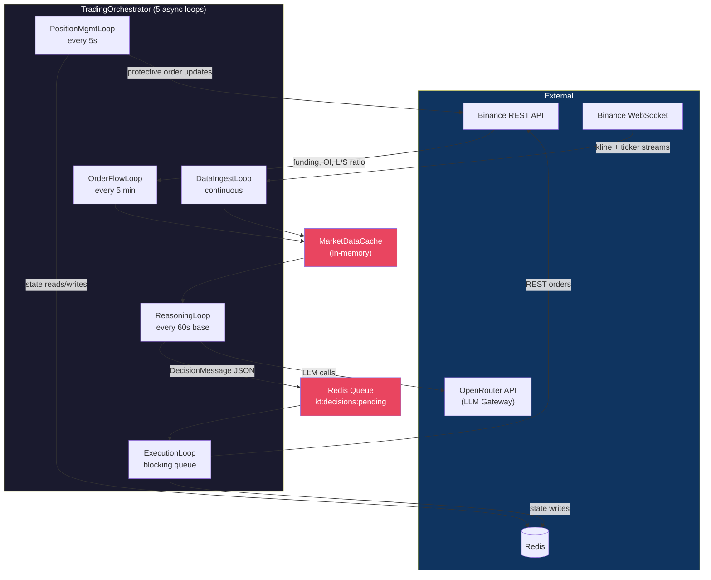
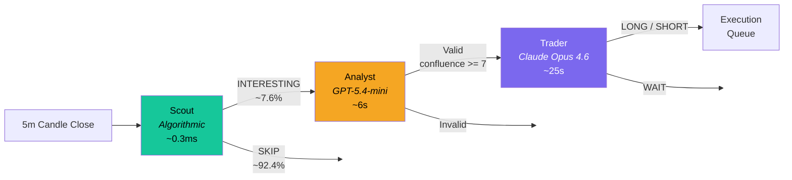
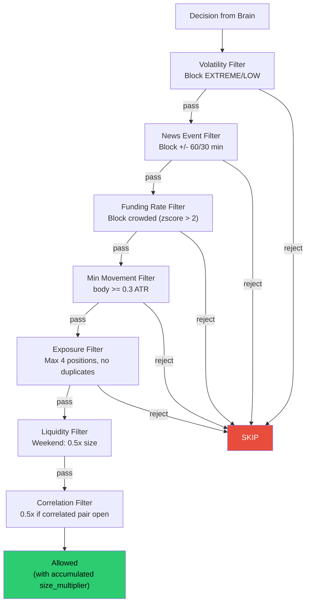
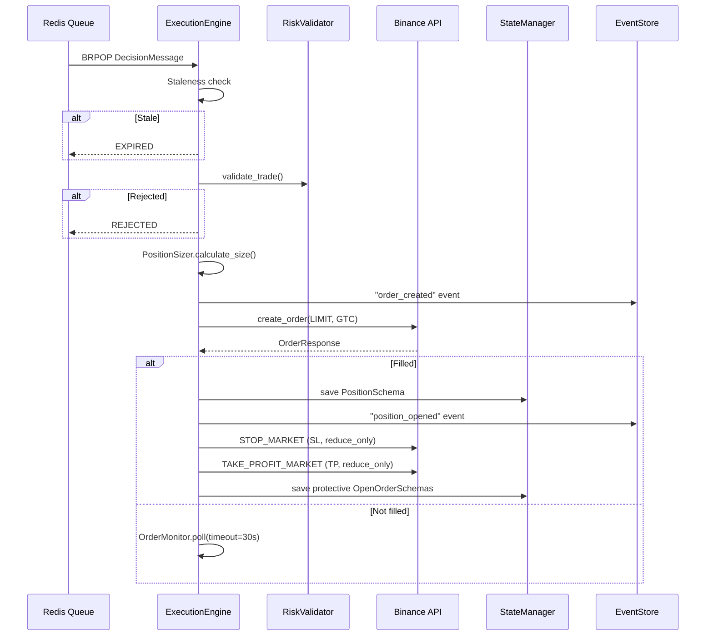
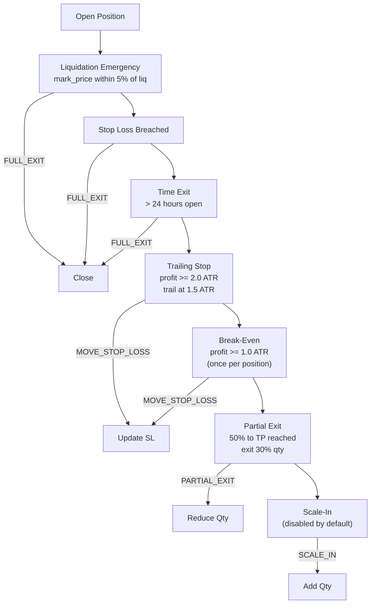
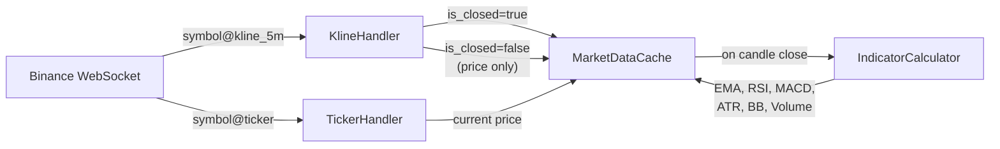
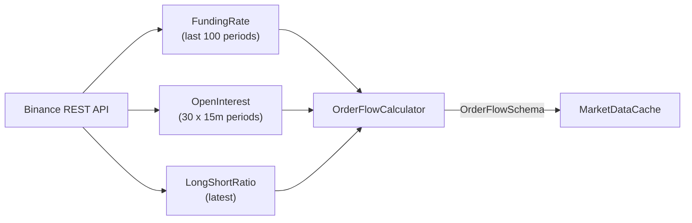
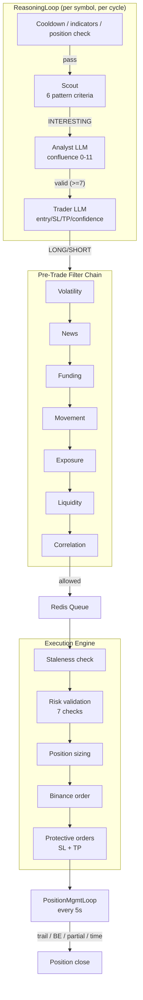

# KavziTrader — Current Architecture

> Snapshot of the system as implemented. Updated 2026-03-28.

---

## 1. High-Level Overview

KavziTrader is an LLM-based cryptocurrency futures trading platform for Binance.
It follows a **Brain-Spine Architecture**: the Brain (LLM agents) handles market
analysis at 500ms-30s latency; the Spine (deterministic engine) handles execution,
risk, and position management at <100ms latency.



---

## 2. Module Map

```
kavzi_trader/
  brain/              # LLM Layer (Brain)
    agent/            #   AgentRouter, AgentFactory, AnalystAgent, TraderAgent
    calibration/      #   Confidence calibration (raw → historical accuracy)
    config.py         #   BrainConfigSchema (models, timeouts)
    context/          #   ContextBuilder, formatters (candles table, compact indicators)
    prompts/          #   Jinja2 templates (system + user prompts)
    schemas/          #   ScoutDecision, AnalystDecision, TradeDecision, Dependencies
  spine/              # Deterministic Layer (Spine)
    execution/        #   ExecutionEngine, DecisionTranslator, OrderMonitor, StalenessChecker
    filters/          #   Scout (algorithmic), PreTradeFilterChain, Confluence, Funding, etc.
    position/         #   PositionManager, TrailingStop, BreakEven, PartialExit, Scaling, TimeExit
    risk/             #   DynamicRiskValidator, PositionSizer, VolatilityRegimeDetector, Exposure
    state/            #   StateManager, PositionStore, OrderStore, AccountStore (Redis-backed)
  orchestrator/       # Loop Coordination
    orchestrator.py   #   TradingOrchestrator (task supervision, auto-restart)
    loops/            #   DataIngest, OrderFlow, Reasoning, Execution, PositionManagement
    providers/        #   MarketDataCache, LiveDependenciesProvider, LiveStreamManager
  api/binance/        # Exchange Integration
    client.py         #   BinanceClient (REST), error mapping
    websocket/        #   WebSocket client, StreamManager, handlers (kline, ticker, user_data, etc.)
  indicators/         # Technical Analysis
    calculator.py     #   TechnicalIndicatorCalculator (orchestrates all indicators)
    trend.py          #   EMA (20/50/200), SMA
    momentum.py       #   RSI (14), MACD (12/26/9)
    volatility.py     #   ATR (14), Bollinger Bands (20, 2.0 std)
    volume.py         #   Volume ratio, OBV
  order_flow/         # Funding & OI Analysis
    calculator.py     #   OrderFlowCalculator (funding z-score, OI momentum, L/S ratio)
  events/             # Event Sourcing (Redis Streams)
    store.py          #   RedisEventStore (append, read, trim)
    projections/      #   PositionsProjection, OrdersProjection, ConfidenceProjection
  paper/              # Paper / Testnet Trading
    exchange.py       #   PaperExchangeClient (simulated fills, margin, PnL)
  reporting/          # Live HTML Reports
    trade_report_populator.py
  config/             # YAML + env-var config loading
  cli/                # Click CLI (trade start, model status, etc.)
  commons/            # Shared utilities (time, path, logging, async)
```

---

## 3. Brain — LLM Decision Pipeline

### 3.1 Three-Tier Agent Pipeline



| Tier | Type | Model | Cost | Latency | Purpose |
|------|------|-------|------|---------|---------|
| **Scout** | Deterministic | None (algorithmic) | $0 | <1ms | Pattern detection + volume/volatility gates |
| **Analyst** | LLM | `openai/gpt-5.4-mini` | ~$0.008/call | ~6s | Setup validation, confluence scoring (0-11) |
| **Trader** | LLM | `anthropic/claude-opus-4.6` | ~$0.05/call | ~25s | Entry/SL/TP calculation, confidence assessment |

### 3.2 Scout — Algorithmic Pattern Filter

Deterministic filter checking 6 criteria (first match wins):

| # | Pattern | Conditions |
|---|---------|-----------|
| 1 | BREAKOUT | Price closes beyond Bollinger Band (%B >= 1.0 or <= 0.0) + volume >= 1.2x |
| 2 | TREND_CONTINUATION | EMA alignment (20>50>200 or reverse) + RSI 40-60 + volume >= 1.0x |
| 3 | REVERSAL | RSI extreme (<30 or >70) + price at BB boundary (%B <0.1 or >0.9) |
| 4 | VOLUME_SPIKE | Volume >= 2.0x + candle body >= 50% of range + supporting signal |
| 5 | MOMENTUM_SHIFT | MACD histogram sign differs from prior 3 candle directions |
| 6 | TREND_PULLBACK | EMA aligned + price moved >= 0.5% in trend direction |

**Gates** (checked before criteria):
- Volatility gate: SKIP if regime is LOW or EXTREME
- Hard volume gate: SKIP if vol_ratio < 0.3
- Soft volume gate: SKIP if vol_ratio < 0.8 and no pattern matched

Config: `kavzi_trader/spine/filters/scout_config.py`

### 3.3 Analyst — Setup Validation

Receives Scout-passed symbols. Scores confluence on a 0-11 scale:

**Algorithm base (0-7 binary signals):**

| Signal | LONG condition | SHORT condition |
|--------|---------------|-----------------|
| ema_alignment | EMA20 > EMA50 > EMA200 | EMA20 < EMA50 < EMA200 |
| rsi_favorable | Trend: 50-70; Reversal: 30-40 | Trend: 30-50; Reversal: 60-70 |
| volume_above_average | vol_ratio > 1.0 | vol_ratio > 1.0 |
| price_at_bollinger | At lower or walking upper | At upper or walking lower |
| funding_favorable | funding_zscore <= 0 | funding_zscore >= 0 |
| oi_supports_direction | OI 1h change > 0 | OI 1h change < 0 |
| volume_spike | vol_ratio > 2.5 | vol_ratio > 2.5 |

**Discretionary (0-4, LLM-assigned):** Order flow alignment (0-2) + price structure (0-2).

**Validity:** `setup_valid = true` only if `confluence_score >= 7` AND `volatility_regime in [NORMAL, HIGH]`.

### 3.4 Trader — Final Decision

Receives Analyst-validated setups. Outputs:

```
action: LONG | SHORT | WAIT | CLOSE
confidence: 0.0-1.0
suggested_entry, suggested_stop_loss, suggested_take_profit
reasoning: str (80-600 chars)
```

**Stop-loss rules:**
- NORMAL volatility: 1.0-1.5x ATR
- HIGH volatility: 1.5-2.0x ATR
- VOLUME_SPIKE / REVERSAL entries: 2.0-2.5x ATR (wider for spike candle range)
- Minimum R:R: 1.5:1

**Account safety:**
- Drawdown > 3%: WAIT
- Drawdown > 5%: CLOSE all
- LOW / EXTREME volatility: WAIT
- SL > 50% of entry-to-liquidation distance: WAIT

### 3.5 Confidence Calibration

Maps raw model confidence to historical win rate:

| Raw Confidence Bucket | Default Accuracy |
|----------------------|-----------------|
| 0.9+ | 0.65 |
| 0.8-0.9 | 0.55 |
| 0.7-0.8 | 0.45 |
| <0.7 | 0.35 |

Stored in Redis. Updated with `record_outcome(decision_id, raw_confidence, was_correct)`.

### 3.6 Prompt System

Jinja2 templates in `brain/prompts/templates/`:

```
system/
  agents/analyst.j2       # Analyst system prompt (trend, confluence, validity rules)
  agents/trader.j2        # Trader system prompt (entry/SL/TP framework, safety rules)
  base/risk_framework.j2  # Shared risk rules
  guides/volatility_regimes.j2
  guides/position_mgmt_guide.j2
user/
  requests/analyze_setup.j2   # Analyst user prompt (market data + confluence)
  requests/make_decision.j2   # Trader user prompt (analyst result + account state)
  context/                     # Reusable context blocks (market, order_flow, account, etc.)
```

**Context optimization:** Compact formatters reduce token usage — indicators as one-line key=value (~80 tokens vs ~600), pipe-delimited candle table.

---

## 4. Spine — Deterministic Execution Layer

### 4.1 Pre-Trade Filter Chain



Each filter can either hard-reject or apply a size multiplier (e.g., weekend 0.5x, correlation 0.5x).

### 4.2 Risk Validation

`DynamicRiskValidator.validate_trade()` performs 7 sequential checks:

| Check | Rule | Action |
|-------|------|--------|
| Drawdown | > 3% pause, > 5% close all | Reject |
| Exposure | Max 4 positions, no duplicate symbols | Reject |
| Volatility | Z-score regime detection | Block EXTREME/LOW, 50% size on HIGH |
| SL Distance | Min 0.5 ATR, max 3.0 ATR | Reject if outside range |
| Risk:Reward | Minimum 1.5:1 | Reject |
| Liquidation | SL must be < 50% of entry-to-liq distance | Reject |
| Margin Ratio | Max 0.5 | Reject |

### 4.3 Position Sizing

```
risk_amount = account_balance * 1.0%
stop_distance = ATR * sl_multiplier
base_size = risk_amount / stop_distance
adjusted_size = base_size * regime_multiplier * filter_multipliers
```

**Caps:**
- Max notional: 50% of balance (configurable)
- Margin constraint: `available_balance * leverage / entry_price`

**Volatility multipliers:**
- LOW (z < -1.5): 0% (blocked)
- NORMAL (-1.5 to 1.0): 100%
- HIGH (1.0 to 2.0): 50%
- EXTREME (z > 2.0): 0% (blocked)

### 4.4 Execution Engine



**Staleness thresholds** (per volatility regime):
- LOW: 5 min
- NORMAL: 2 min
- HIGH: 30s
- EXTREME: 10s

### 4.5 Position Management

Runs every 5 seconds per open position. Evaluation order (first action wins):



---

## 5. Orchestrator — Async Loop Coordination

### 5.1 Loop Timing

```mermaid
gantt
    title Loop Intervals (not to scale)
    dateFormat X
    axisFormat %s

    section Continuous
    DataIngestLoop (WebSocket)        :active, 0, 100

    section Periodic
    OrderFlowLoop (300s)              :crit, 0, 5
    OrderFlowLoop                     :crit, 50, 55
    ReasoningLoop (60s base + backoff):60, 62
    ReasoningLoop                     :done, 75, 77
    PositionMgmtLoop (5s)             :0, 1
    PositionMgmtLoop                  :5, 6
    PositionMgmtLoop                  :10, 11
    HealthCheck (30s)                 :30, 31
    HealthCheck                       :60, 61
```



| Loop | Interval | Backoff | Communication |
|------|----------|---------|---------------|
| **DataIngest** | Continuous (WebSocket) | Reconnect on disconnect | Writes to MarketDataCache |
| **OrderFlow** | 300s (5 min) | None, tolerates failures | Writes to MarketDataCache |
| **Reasoning** | 60s base | 2x exponential up to 6x (360s) on all-SKIP; resets on any INTERESTING | Reads MarketDataCache, writes Redis queue |
| **Execution** | Blocking (BRPOP 1s timeout) | 0.1s sleep on empty queue | Reads Redis queue, writes State + Exchange |
| **Position** | 5s | None | Reads/writes State, writes Exchange |
| **Health** | 30s | None | Reads component checks |
| **Report** | 5s (hardcoded) | None | Reads State, writes HTML file |

### 5.2 Task Supervision

The `TradingOrchestrator` uses `asyncio.wait(FIRST_COMPLETED)` to monitor all loops.
If any task exits (crash or clean), it is automatically restarted via stored factory functions.

**Startup sequence:**
1. Connect StateManager to Redis
2. Reconcile with exchange (skip in paper mode)
3. Spawn all loop tasks
4. Enter supervision loop

**Shutdown:** Cancel all tasks → `asyncio.gather(return_exceptions=True)` → close StateManager.

### 5.3 Analyst Cooldown (Graduated)

After the Analyst rejects a symbol, it is placed on cooldown based on confluence score:

| Confluence Score | Cooldown Multiplier | Cycles (at base=3) | Time (at 60s interval) |
|-----------------|--------------------|--------------------|----------------------|
| <= 3 (low) | 5x | 15 | ~15 min |
| 4-5 (medium) | 3x | 9 | ~9 min |
| >= 6 (near threshold) | 1x | 3 | ~3 min |

When a trade is enqueued, the symbol gets `cooldown_cycles * 3` (9 cycles) to avoid re-evaluation during execution.

---

## 6. Data Flow — End to End

### 6.1 Market Data Ingestion



**Cache structure** (per symbol):
- `candles: deque[CandlestickSchema]` (max 500)
- `indicators: TechnicalIndicatorsSchema`
- `order_flow: OrderFlowSchema`
- `current_price: Decimal`
- `atr_history: list[Decimal]` (max 30)

**Initialization:** REST backfill of 1000 candles → compute indicators → seed 30-entry ATR history.

### 6.2 Order Flow Data



**OrderFlowSchema fields:** funding_rate, funding_zscore, next_funding_time, open_interest, oi_change_1h_percent, oi_change_24h_percent, long_short_ratio, long/short_account_percent, price_change_1h_percent.

**Derived flags:** `is_crowded_long` (zscore > 2.0), `is_crowded_short` (zscore < -2.0), `squeeze_alert` (OI change > 5% + price change > 0.5%).

### 6.3 Decision Pipeline (Full)



---

## 7. State & Persistence

### 7.1 Redis Key Patterns

| Resource | Key Pattern | Type | TTL |
|----------|------------|------|-----|
| Position | `kt:state:positions:{id}` | Hash | None |
| Order | `kt:state:orders:{id}` | Hash | None |
| Account | `kt:state:account` | String (JSON) | None |
| Decision Queue | `kt:decisions:pending` | List | None |
| Order Events | `kt:events:orders` | Stream | 90 days |
| Position Events | `kt:events:positions` | Stream | 90 days |
| Decision Events | `kt:events:decisions` | Stream | 90 days |
| System Events | `kt:events:system` | Stream | 90 days |
| Liquidation Events | `kt:events:liquidations` | Stream | 90 days |

Streams capped at ~100,000 entries via approximate trimming.

### 7.2 State Schemas

**PositionSchema:**
```
id, symbol, side (LONG/SHORT), quantity, entry_price,
stop_loss, take_profit, current_stop_loss,
management_config, leverage, liquidation_price,
initial_margin, unrealized_pnl, accumulated_funding,
stop_loss_moved_to_breakeven, partial_exit_done,
opened_at, updated_at
```

**AccountStateSchema:**
```
total_balance_usdt, available_balance_usdt, locked_balance_usdt,
unrealized_pnl, peak_balance, current_drawdown_percent,
total_margin_balance, margin_ratio, updated_at
```

### 7.3 Event Sourcing

All state changes emit immutable events to Redis Streams:

```
EventSchema:
  event_id: UUID
  event_type: str ("order_created", "position_opened", etc.)
  version: int
  timestamp: datetime
  aggregate_id: str (decision_id, position_id)
  aggregate_type: str ("decision", "position", "order", "system")
  data: dict
  metadata: dict
```

Projections (`PositionsProjection`, `OrdersProjection`, `ConfidenceProjection`) materialize read models from event streams.

---

## 8. Exchange Integration

### 8.1 WebSocket Streams

| Stream | Format | Used By |
|--------|--------|---------|
| Kline | `{symbol}@kline_5m` | DataIngestLoop → candle updates |
| Ticker | `{symbol}@ticker` | DataIngestLoop → price updates |
| Mark Price | `{symbol}@markPrice@1s` | Position management (liquidation checks) |
| Force Order | `{symbol}@forceOrder` | Liquidation monitoring |
| User Data | `user-data-stream` | Account/order status updates |

### 8.2 REST Endpoints Used

| Endpoint | Called By | Frequency |
|----------|----------|-----------|
| `GET /fapi/v1/klines` | Cache init (backfill) | Once at startup |
| `GET /fapi/v1/fundingRate` | OrderFlowFetcher | Every 5 min |
| `GET /fapi/v1/openInterest` | OrderFlowFetcher | Every 5 min |
| `GET /fapi/v1/topLongShortAccountRatio` | OrderFlowFetcher | Every 5 min |
| `POST /fapi/v1/order` | ExecutionEngine | On trade signals |
| `GET /fapi/v2/account` | Reconciliation, reporting | Startup + every 5s |
| `GET /fapi/v2/positionRisk` | Reconciliation | Startup |

---

## 9. Technical Indicators

All indicators computed on candle close via `TechnicalIndicatorCalculator`:

| Indicator | Parameters | Key Usage |
|-----------|-----------|-----------|
| **EMA** | 20, 50, 200 periods | Trend direction (Scout, Analyst confluence) |
| **SMA** | 20 period | Bollinger middle band |
| **RSI** | 14 period | Overbought/oversold (Scout reversal, Analyst RSI favorable) |
| **MACD** | 12/26/9 | Momentum shift detection (Scout) |
| **ATR** | 14 period | Stop-loss sizing, volatility regime detection |
| **Bollinger Bands** | 20 period, 2.0 std | Breakout/reversal detection (Scout), key levels |
| **Volume Ratio** | Current / 20-period avg | Volume spike detection, trend confirmation |
| **OBV** | Cumulative | Divergence detection |

**Volatility Regime Detection** (ATR Z-score over 30 periods):

| Regime | Z-score Range | Trading Action |
|--------|--------------|----------------|
| LOW | z < -1.5 | Blocked (no trades) |
| NORMAL | -1.5 <= z < 1.0 | Full size, 1.0-1.5x ATR stops |
| HIGH | 1.0 <= z < 2.0 | 50% size, 1.5-2.0x ATR stops |
| EXTREME | z >= 2.0 | Blocked (no trades) |

---

## 10. Configuration

### 10.1 Loading

```
config/config.yaml  →  AppConfig.from_file()  →  _apply_env_overrides(KT_*)
```

Environment variables with `KT_` prefix override YAML values. Secrets (API keys) should always be set via env vars.

### 10.2 Key Config Sections

| Section | Key Parameters |
|---------|---------------|
| `brain` | openrouter_api_key, request_timeout_s=120, analyst.model_id, trader.model_id |
| `scout` | blocked_regimes=[LOW,EXTREME], vol thresholds, 6 pattern criteria params |
| `trading` | 18 symbols, interval=5m, history_candles=1000 |
| `futures` | default_leverage=5, margin_type=ISOLATED, symbol_leverage overrides (TAO/WIF/TON: 3x) |
| `risk` | risk_per_trade_percent=1.0, max_positions=4, min_rr_ratio=1.5, drawdown thresholds |
| `position_management` | trailing_stop_atr=1.5, break_even_trigger=1.0 ATR, partial_exit=30% at 50% to TP, max_hold=24h |
| `filters` | crowded zscore=+/-2.0, min_body_atr=0.3, news block=60/30 min, weekend=0.5x |
| `execution` | timeout_s=30, staleness thresholds per regime |
| `orchestrator` | reasoning_interval=60s, position_check=5s, order_flow=300s, health=30s |

---

## 11. CLI

```bash
uv run kavzitrader trade start            # Start live trading
uv run kavzitrader trade start --paper    # Paper trading mode
uv run kavzitrader trade start --dry-run  # Analysis only, no execution
uv run kavzitrader trade status           # Show open positions/orders
uv run kavzitrader trade positions        # List position details
uv run kavzitrader trade history          # Recent events from Redis
uv run kavzitrader model status           # Check LLM connectivity
uv run kavzitrader config --validate      # Validate configuration
```

---

## 12. Paper Trading

`PaperExchangeClient` extends `BinanceClient`:
- **Read-only methods** (klines, tickers, funding) hit real Binance for live market data
- **Order methods** simulated locally with instant fills at ticker price
- **Margin tracking:** locks initial_margin on open, releases +/- PnL on close
- **Commission:** 0.1% taker fee (configurable)
- State stored in Redis via normal StateManager path

Trading modes: `LIVE` | `TESTNET` | `PAPER` | `DISABLED`

---

## 13. Reporting

**Live HTML reports** generated every 5s during trading sessions:

- Session summary: start time, duration, balance, PnL, drawdown
- Activity log: Scout/Analyst/Trader decisions with reasoning
- Trade table: entry, SL, TP, status, confidence
- Position snapshots: current prices, unrealized PnL
- Market prices: all monitored symbols

Output: `results/reports/trade_report_YYYYMMDD_HHMMSS.html` (auto-refreshing).

**Post-session analysis reports** generated by the `run-analyzer` agent from JSONL logs in `results/logs/`. Output: `reports/report_YYYY_MM_DD.md`.

---

## 14. Symbols Monitored

18 USDT-M perpetual futures:

| Wave | Symbols | Leverage |
|------|---------|----------|
| Core | BTCUSDT, ETHUSDT, SOLUSDT, XRPUSDT, DOGEUSDT, BNBUSDT, TAOUSDT (3x), SUIUSDT, ADAUSDT | 5x default |
| Wave 1 | AVAXUSDT, LINKUSDT, LTCUSDT, NEARUSDT | 5x |
| Wave 2 | INJUSDT, WIFUSDT (3x), TONUSDT (3x), BCHUSDT, AAVEUSDT | 5x default |

Correlated pairs tracked for exposure reduction (e.g., BTC↔ETH↔LTC↔BCH, SOL↔AVAX↔SUI↔NEAR↔INJ).
